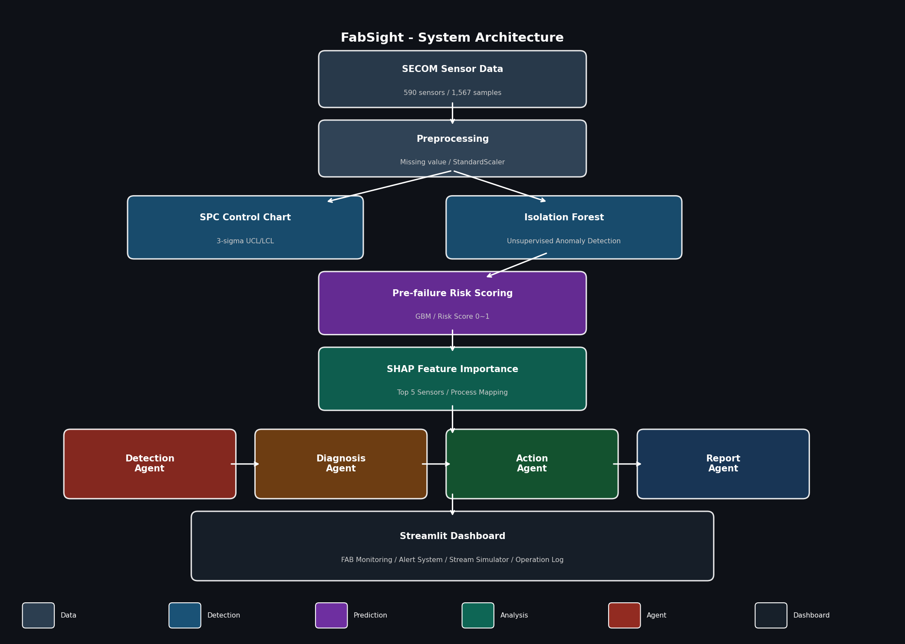

# FabSight
**Smart Semiconductor Fab Monitoring & Anomaly Diagnosis System**

[](https://python.org)
[](https://streamlit.io)
[](https://openai.com)
[](https://jeong-inn-fabsight-srcdashboardapp-mcwb99.streamlit.app)

[](https://jeong-inn-fabsight-srcdashboardapp-mcwb99.streamlit.app/)
https://jeong-inn-fabsight-srcdashboardapp-mcwb99.streamlit.app/

FabSight는 반도체 제조 공정의 설비 이상 탐지, 고장 위험 조기 예측, Agent 기반 진단, Digital Twin inspired 시뮬레이션을 결합한 **AI 운영 분석 시스템**입니다.


**Project Goal:**  
반도체 제조 공정에서 이상 탐지, 고장 위험 조기 예측, 원인 분석, 조치 제안을 하나의 운영 분석 시스템으로 통합하는 것

---

## Why FabSight

반도체 제조 공정은 수백 개의 센서와 설비 상태 변수를 동시에 모니터링해야 하며, 이상 징후를 놓치면 수율 손실과 운영 중단으로 이어질 수 있다.  
기존 SPC 기반 rule 시스템은 단일 센서 기준 관리에는 효과적이지만, 비정규 분포와 고차원 센서 간 복합 패턴을 충분히 반영하기 어렵다.

FabSight는 **Fab operator와 process engineer가 이상 상황을 조기에 인지하고 대응 우선순위를 판단할 수 있도록 설계한 AI 기반 Fab 운영 분석 시스템**이다.

- **SPC + ML 이중 이상탐지**로 rule 기반 한계를 보완하고
- **Pre-failure Risk Scoring**으로 현재 설비 상태 기반 위험도를 조기 예측하며
- **Tool-based Agent Diagnosis**를 통해 원인 분석과 조치 제안을 자동화하고
- **Digital Twin inspired simulation**으로 공정 이상 시나리오를 재현한다

---

## What makes FabSight different?

일반적인 이상 탐지 프로젝트가 모델 성능 비교에 머무르는 반면, FabSight는 반도체 제조 공정 맥락에서  
**이상 탐지 → 위험도 예측 → 원인 분석 → Agent 기반 조치 리포트 → 운영 시뮬레이션**까지 연결된 시스템 구조를 설계했다.

이 프로젝트의 차별화 포인트는 데이터셋 자체보다, 공개 반도체 공정 데이터를 기반으로 **운영 분석 시스템 관점의 AI 구조를 설계하고 검증했다는 점**에 있다.

---

## System at a Glance
FabSight는 탐지, 예측, 해석, 조치 제안을 분리된 계층으로 구성하여 운영자가 이상 상황을 빠르게 인지하고 대응할 수 있도록 설계했다.

| Layer | Purpose | Key Components |
|---|---|---|
| Monitoring | 공정 상태 실시간 시각화 | FAB cards, risk chart |
| Detection | 이상 탐지 | SPC, Isolation Forest + PCA |
| Prediction | 고장 위험 조기 예측 | GBM Risk Scorer |
| Analysis | 원인 해석 | SHAP, process contribution |
| Orchestration | 진단/조치 자동화 | Tool-based Agent (4단계) |
| Simulation | 운영 시나리오 검증 | Digital Twin inspired simulator |

---

## Dataset

- **SECOM Dataset** (UCI ML Repository)
- 590개 센서, 1,567 샘플, 전처리 후 446개 피처
- 클래스 불균형 14:1 (정상 1,463 : 불량 104)
- 센서 익명화 → 공정 매핑 테이블(CVD/ETCH/CMP/LITHO)로 도메인 해석
- 결측치 비율이 높은 컬럼 제거, 중앙값 대체, 분산 0 컬럼 제거, StandardScaler 정규화를 적용

---

## System Architecture

### Overall System

FabSight는 센서 데이터 입력부터 이상 탐지, 위험 예측, 원인 분석, 운영자 리포트 생성까지를 하나의 운영 분석 파이프라인으로 연결하도록 설계했다.

### Agent Orchestration Flow

LLM은 탐지 결과 자체를 대체하는 판단 엔진이 아니라, 모델 및 분석 결과를 운영자 친화적인 진단·조치 흐름으로 연결하는 orchestration 계층으로 사용했다.

---

## Key Design Decisions

- **Why SPC + ML?**  
  SPC는 rule 기반 모니터링에 강점이 있지만, 고차원 복합 패턴 탐지에는 한계가 있어 Isolation Forest를 병행했다.

- **Why risk scoring instead of time-series forecasting?**  
  SECOM은 정적 샘플 데이터이므로 시계열 예측보다 현재 설비 상태 기반 위험도 분류가 더 타당하다고 판단했다.

- **Why SHAP + process mapping?**  
  단순 센서 중요도만으로는 운영자 의사결정에 한계가 있어, 공정 단위 기여도로 집계해 해석성을 높였다.

- **Why tool-based agents?**  
  LLM을 판단 엔진 자체로 사용하기보다, 모델과 분석 결과를 운영자 친화적 진단 흐름으로 연결하는 orchestration 계층으로 사용했다.

---

## Core Capabilities

### 1. Fab Monitoring Layer
공정별 설비 상태를 NORMAL / WARNING / ANOMALY 단계로 시각화하고, 공정 위험도를 비교하여 운영자가 우선 대응 대상을 빠르게 식별할 수 있도록 설계했다.

### 2. SPC Control Chart
정상 데이터 기준 3-sigma UCL/LCL을 계산하고, 센서별 관리 한계 이탈 샘플을 시각화한다.

### 3. Anomaly Detection & Pre-failure Risk Scoring
- **Isolation Forest + PCA**: 비지도 학습 기반 이상탐지. 446차원 → 50차원 축소로 차원의 저주 보완
- **GBM Risk Scorer**: SMOTE + threshold tuning으로 Recall 최대화. HIGH / MEDIUM / LOW 위험 등급 분류

### 4. SHAP + Process Contribution Analysis
SHAP Feature Importance 기반 Top 5 센서 추출 후 공정 단위 기여도로 집계하여 운영자 의사결정을 지원한다.

| 공정 | 기여도 | 핵심 센서 |
|---|---|---|
| CVD | 40.3% | Sensor_31, Sensor_419 |
| ETCH | 22.0% | Sensor_487 |
| CMP | 19.8% | Sensor_545 |
| LITHO | 17.9% | Sensor_59 |

### 5. Tool-based Agent Diagnosis
이상 탐지 결과를 운영자가 해석 가능한 형태로 전환하기 위해 tool-based agent orchestration 구조를 적용했다.

| Agent | 역할 | 입력 | 출력 |
|---|---|---|---|
| Detection Agent | 이상 탐지 결과 취합 | 센서 데이터 | anomaly count, risk score |
| Diagnosis Agent | 근본 원인 분석 | SHAP + 공정 매핑 | root cause sensors, process contribution |
| Action Agent | 조치 우선순위 추천 | 진단 결과 | inspection checklist |
| Report Agent | 운영자 리포트 생성 | 전체 분석 결과 | operator-facing report |

> 완전 자유 탐색형 멀티 에이전트보다는, 반도체 운영 분석 시나리오에 맞춘 **tool-guided orchestration**에 가깝게 설계했다.

### 6. Digital Twin Inspired Simulator
공정별 물리 파라미터(온도/압력/유량) 범위를 기반으로 공정 상태 변화와 센서 드리프트 누적을 경량 방식으로 시뮬레이션하고, normal → warning → critical 전이를 재현한다.

### 7. Operation Log
Agent 실행 이력을 자동 저장하여 이상 패턴 추적 및 운영 이력 관리를 지원한다.

---

## Experiments & Results
FabSight의 목표는 일반적인 분류 정확도 최적화가 아니라, 공정 운영 환경에서 치명적인 미탐(False Negative)을 줄일 수 있는 운영 친화적 임계값을 찾는 데 있다.

### Final Model Performance

| 모델 | Precision | Recall | F1 | ROC-AUC |
|---|---|---|---|---|
| SPC (3-sigma) | - | - | - | - |
| Isolation Forest + PCA | 0.120 | 0.120 | 0.120 | - |
| GBM + SMOTE + PCA + Threshold | 0.079 | 0.476 | 0.135 | 0.584 |
최종 운영 모델은 Precision보다 Recall을 우선시하는 공정 운영 전략에 따라 **GBM + SMOTE + PCA + Threshold Tuning** 조합을 선택했다.

### GBM Ablation Study

SECOM 데이터는 14:1의 클래스 불균형과 446차원의 고차원 특성을 동시에 가지므로, 단순한 분류 모델은 이상 샘플을 거의 탐지하지 못했다. FabSight에서는 단순 정확도보다 **공정 운영 관점에서 중요한 Recall 확보**를 목표로 실험을 설계했다.

| Setting | Precision | Recall | F1 | ROC-AUC |
|---|---|---|---|---|
| Baseline (GBM) | 0.250 | 0.095 | 0.138 | 0.729 |
| + SMOTE | 0.333 | 0.048 | 0.083 | 0.652 |
| + SMOTE + PCA | 0.182 | 0.095 | 0.125 | 0.535 |
| + SMOTE + PCA + Threshold Tuning | 0.079 | **0.476** | 0.135 | 0.584 |

- **SMOTE 단독**: 고차원(446차원)에서 합성 샘플 품질 저하 → Recall 오히려 감소
- **PCA 추가**: 50차원으로 축소 후 SMOTE 효과 회복
- **Threshold Tuning**: 운영 임계값 0.2 + class weight 8 → Recall 0.095 → 0.476 (5배 개선)
- **ROC-AUC 하락은 의도된 트레이드오프**: 반도체 공정에서 미탐지(False Negative)는 수율 손실로 직결. 오탐지 비용 < 미탐지 비용.

---

## Operational Scenarios

### Scenario 1 — CVD 공정 이상 감지 및 자동 진단
```
1. CVD 챔버 압력 센서(Sensor_31) 드리프트 발생
2. Isolation Forest → 이상 샘플 탐지
3. GBM Risk Scorer → 위험도 0.85 (HIGH)
4. SHAP 분석 → CVD 공정 기여도 40.3% 확인
5. Agent → analyze_anomaly → diagnose_root_cause → get_action_plan 순서로 판단
6. 운영자에게 "챔버 압력 센서 점검 / 가스 유량 컨트롤러 확인" 조치 리포트 전달
```
**Operational impact:** CVD 공정의 압력 드리프트를 조기에 탐지해 챔버 점검 우선순위를 높임으로써, 수율 저하 전 예방 대응이 가능하다.

### Scenario 2 — ETCH 공정 위험도 상승 모니터링
```
1. ETCH 플라즈마 관련 센서(Sensor_487) 이상 징후
2. SPC 관리도 → UCL 이탈 감지
3. Risk Score 점진적 상승 → WARNING 알림 발생
4. Digital Twin Simulator → ETCH 공정 drift 누적 시뮬레이션
5. 사전 예방 조치 → "RF 매칭 네트워크 점검 / 가스 흐름 균일성 체크"
```
**Operational impact:** 이상이 심화되기 전 WARNING 단계에서 조기 개입하여 CRITICAL 전환을 방지한다.

### Scenario 3 — 다중 공정 동시 이상
```
1. CVD + CMP 동시 이상 징후 → 고위험 샘플 급증
2. CRITICAL 배너 자동 표시
3. Agent → 복합 근본 원인 분석 → 우선순위 기반 조치 계획 생성
4. 운영 로그 자동 저장 → 이력 추적
```
**Operational impact:** 단일 공정이 아닌 복합 이상 상황에서도 Agent가 우선순위를 자동 판단하여 운영자 대응 부담을 줄인다.

---

## Tech Stack

FabSight는 경량 ML 모델, LLM orchestration, Streamlit 기반 대시보드를 결합하여 연구용 모델 실험을 넘어 운영 분석 시스템 프로토타입을 구현하는 데 초점을 맞췄다.
| 분류 | 기술 |
|---|---|
| Language | Python 3.9 |
| ML/AI | Scikit-learn, SHAP, GradientBoosting, imbalanced-learn |
| LLM | OpenAI GPT-4o-mini (Function Calling) |
| Dashboard | Streamlit |
| Data | SECOM Dataset (UCI ML Repository) |

---

## Limitations & Future Work

### 현재 한계
- **데이터**: SECOM은 공개 데이터셋으로 실제 Fab 환경과 차이 존재. 센서명 익명화로 도메인 해석 제한
- **Agent 구조**: Tool-guided orchestration에 가까움. 완전 자유 탐색형 ReAct는 아님
- **Digital Twin**: 실제 설비 physics 기반이 아닌 경량 파라미터 시뮬레이션
- **모델 성능**: 고차원 데이터 특성상 F1 0.135 수준. Recall 최대화 전략으로 보완


### Future Work
- 실제 Fab 센서 데이터 연동 시 EDD + LLM RAG로 센서명 자동 해석 아키텍처 확장
- LangGraph 기반 멀티 에이전트 협업 구조로 확장
- 시계열 센서 데이터 확보 시 LSTM 기반 예측 모델 추가
- 실제 설비 물리 모델 기반 Digital Twin 고도화

---

## Run Locally
```bash
# 1. 설치
pip install -r requirements.txt

# 2. 환경변수 설정
cp .env.example .env
# .env에 OPENAI_API_KEY 입력

# 3. 전처리 실행
python src/preprocessing/preprocess.py

# 4. SHAP 분석
python src/analysis/feature_importance.py

# 5. 대시보드 실행
PYTHONPATH=$(pwd) streamlit run src/dashboard/app.py
```

---

## Project Structure
```
fabsight/
├── data/raw/              # 처리된 데이터 및 분석 결과
├── src/
│   ├── preprocessing/     # 데이터 전처리
│   ├── detection/         # SPC, Isolation Forest
│   ├── analysis/          # SHAP Feature Importance
│   ├── prediction/        # Pre-failure Risk Scorer (GBM)
│   ├── agents/            # Tool-based Agent Pipeline
│   ├── simulator/         # Digital Twin inspired Simulator
│   ├── dashboard/         # Streamlit 앱
│   └── process_map.py     # 공정 매핑 테이블
├── docs/                  # 아키텍처 다이어그램, Demo GIF
├── .env.example
├── requirements.txt
└── README.md
```
